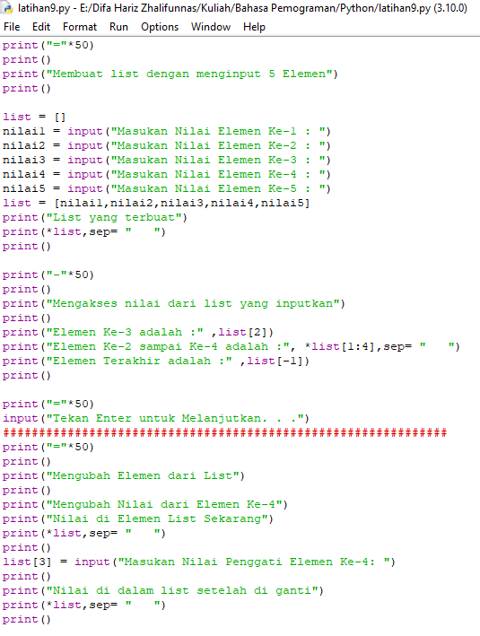

# Latihan09
## Tugas Latihan - Pertemuan 9
## Materi List, Tuple, dan Dictionary

**Ini adalah code pyhton saya**

**Membuat List dengan memasukan 5 Nilai.**\
**Nilai yang di input adalah 69, 79, 48, 26, dan 50**\
**Menampilkan listnya**\
**Mengakses nilai list.**

**Mengubah elemen ke-4 dari list dan menampilkannya**\
**Dengan input 32.**

**Mengubah elemen ke-4 sampai elemen terakhir**\
**Dengan input 81 dan 15**

**Membuat list dengan 2 elemen dari list pertama**\
**Dan menampilkannya**\
**Menambahkan nilai baru kedalam List Kedua(B) dengan nilai String**\
**Dengan input "Iyak"**

**Menambakan 3 Nilai baru kedalam list kedua(B)**\
**Dengan input 96, 37, dan 23**

